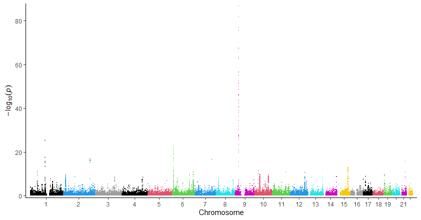
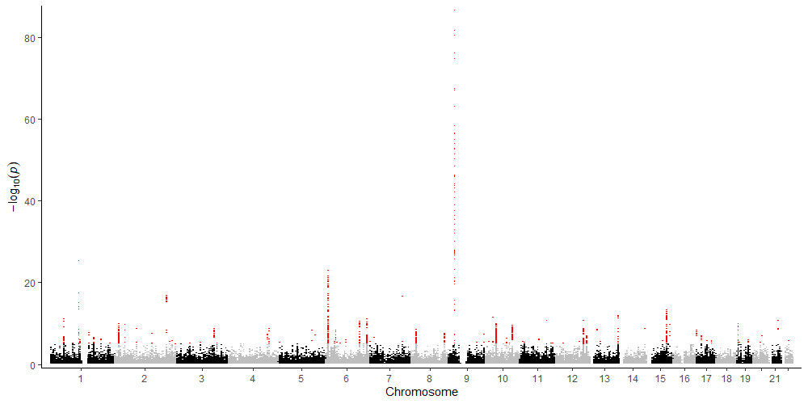
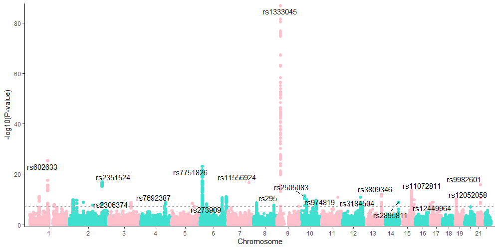
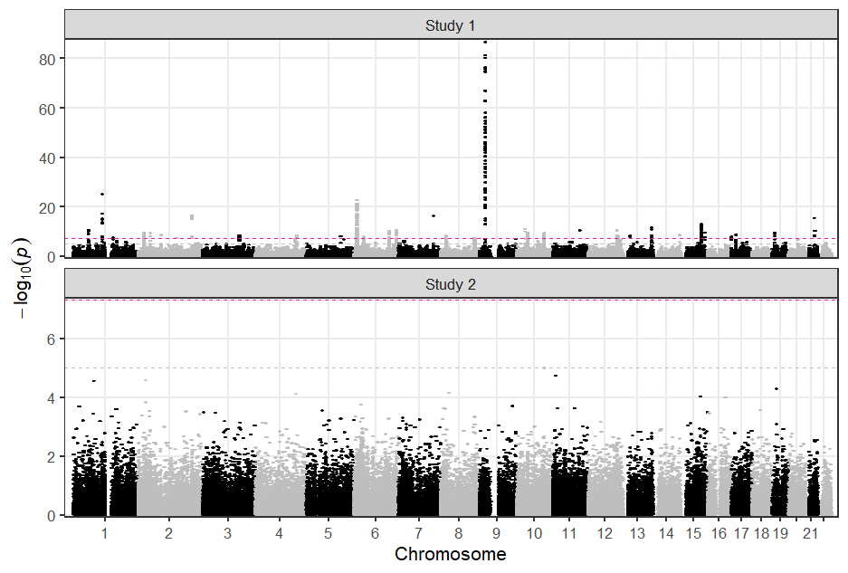
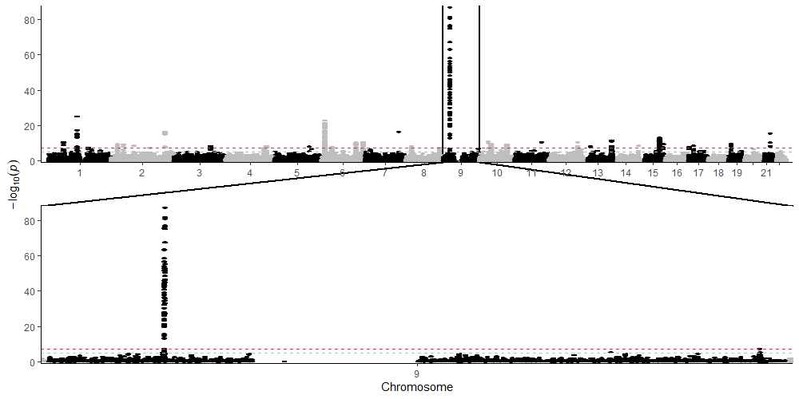
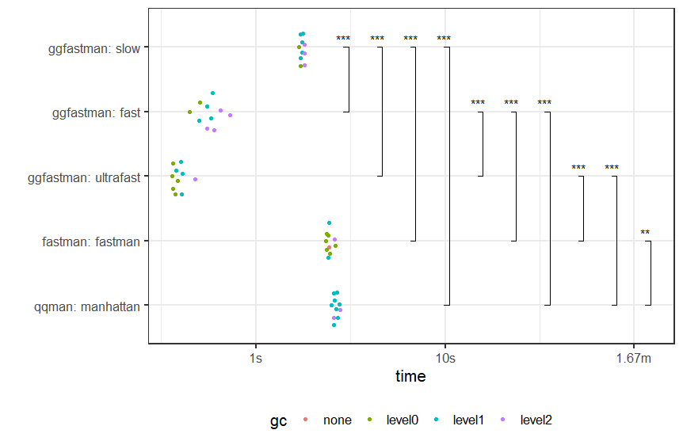
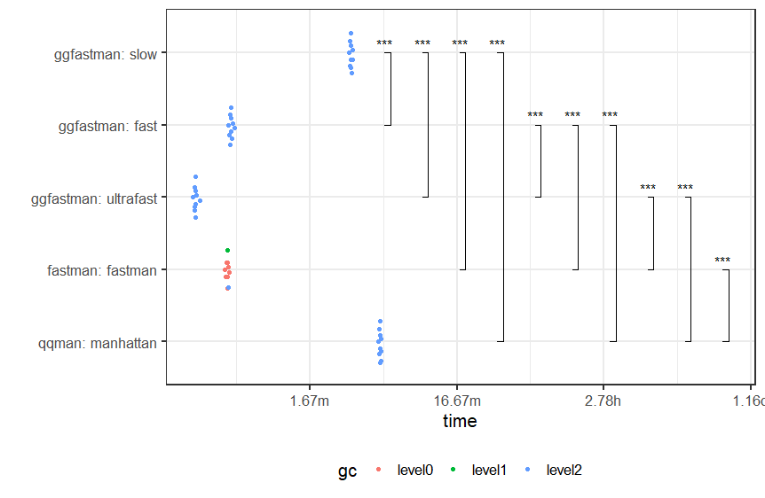

# Introduction

This is a very fast and easy-to-individualize plotting function for GWAS results e.g. pvalues. Since I'm using ggplot2 a lot, I adopted the idea from a very nice [project](https://github.com/boxiangliu/manhattan) from boxiangliu and combined it with a super fast plotting approach from the [scattermore project](https://github.com/exaexa/scattermore).  

A manhattan plot displays pvalues chromosomal positions against -mostly -log10 values- of genome-wide association studies between single nucleotide variants (SNV) or polymorphisms (SNP) and an endpoint e.g. expression, enzyme activity or case-control data. 

One of the first R packages offering manhattan as well as qq plots was [qqman](https://github.com/stephenturner/qqman) from [Stephen Turner](https://twitter.com/strnr), and nowadays there are a lot of different packages and approaches available for R and python. But a very fast one, which is still fast when plotting billions of data points, is still missing. 

This package `ggfastman` is trying to fill this gap. 


# Installation

So far the package is tested on Windows and MacOS, but is not on Cran, thus you need to: 


    devtools::install_github("roman-tremmel/ggfastman", upgrade = "never")
 
The package is depending on the additional packages `ggplot2` and `scattermore`. So far, the latter one has to be installed using:

    devtools::install_github('exaexa/scattermore', dependencies = F, force = T, upgrade = "never")
    
# Usage

## The normal one

As an example you can load some data which is included in the package and run following code. More information of the data set is provided [here](https://github.com/boxiangliu/manhattan).

```{r}
library(ggfastman)
data("gwas_data")
head(gwas_data)
```

Important is that the data has the three columns which are required: 

1. `chr`
2. `pos`
3. `pvalue`

The `chr` should be in the format `c("chr1", "chr2", "chr3", "chrX"...)`, the `pos` column must be a numeric vector reflecting base pair positions and the `pvalue` column contains the pvalues. 


We can plot the manhattan figure with the speed option "slow" using only ggplot2 functions as follows. 

```{r}
fast_manhattan(gwas_data, build='hg18', speed = "slow")
```

## The fast way

Depending on your system this takes a while, particularly when plotting pvalues of more than 1,000,000 SNVs. Therefore, we replace the `geom_point()` function with the `scattermore::geom_scattermore()` function by calling the manhattan function using the `"fast"` option. 

```{r}
fast_manhattan(gwas_data, build='hg18', speed = "fast")
#or
fast_manhattan(gwas_data, build='hg18', speed = "f")
```
Zooooom, that was fast, right? How does it work? For the explanation I want to refer to the `scattermore` package. Only so much, the speed is reached with some C code, rasterization and some magic.

Of course you can increase the point size and the resolution by loosing some of the speed. 

```{r}
fast_manhattan(gwas_data, build='hg18', speed = "fast", pointsize = 3, pixels = c(1000, 1000))
```


## The insane way

The fastest option is `speed = "ultrafast"`. The fastest way costs that the data is plotted only in pure black. But I think it is it worth. Benchmarks are analysed [below](https://github.com/roman-tremmel/ggfastman#benchmarks) 

```{r}
# some big data file with >10^6 rows
big_gwas_data <-  do.call(rbind, replicate(15, gwas_data, simplify = FALSE)) 
fast_manhattan(big_gwas_data, build='hg18', speed = "ultrafast")

# compare with
fast_manhattan(big_gwas_data, build='hg18', speed = "fast")

# not compare with, unless you want to wait some minutes
fast_manhattan(big_gwas_data, build='hg18', speed = "slow")

```

## Individualization 

Of course you can individualize the plot using standard ggplot2 functions.

- xy-scales

```{r}
fast_manhattan(gwas_data, build='hg18', speed = "fast", y_scale = F) +
  ylim(2, 10)
# Of note, set `y_scale = F` to avoid the error of a second y-scale.
  
# distinct chromosomes  on x-axis
fast_manhattan(gwas_data[gwas_data$chr %in% c("chr1", "chr10", "chr22"),], build='hg18', speed = "fast")
  
```

- color

Add color globally or highlight only individual SNPs. Of note, this is working for `shape` in the "slow"-mode as well.

```{R}
gwas_data2 <- gwas_data
gwas_data2$color <- as.character(factor(gwas_data$chr, labels = 1:22))
fast_manhattan(gwas_data2, build = "hg18", speed = "fast")
```



Highlight only some SNPs

```{r}
gwas_data2$color <- NA
gwas_data2[gwas_data2$pvalue < 1e-5, ]$color <- "red"
fast_manhattan(gwas_data2, build = "hg18", speed = "fast")
```




- add significance line(s) and snp annotation(s)

```{r}
library(tidyverse)
library(ggrepel)
fast_manhattan(gwas_data, build='hg18', speed = "fast", color1 = "pink", color2 = "turquoise", pointsize = 3, pixels = c(1000, 500)) +
  geom_hline(yintercept = -log10(5e-08), linetype =2, color ="darkgrey") + # genomewide significance line
  geom_hline(yintercept = -log10(1e-5), linetype =2, color ="grey")  + # suggestive significance line
  ggrepel::geom_text_repel(data = . %>% group_by(chr) %>% # ggrepel to avoid overplotting
                             top_n(1, -pvalue) %>% # extract highest y values
                             slice(1) %>% # if there are ties, choose the first one
                             filter(pvalue <= 5e-08), # filter for significant ones 
                             aes(label=rsid), color =1) # add top rsid
```




- Facetting

```{r}
library(tidyverse)
gwas_data %>% 
  mutate( gr= "Study 1") %>% 
  # rbind a second study
  bind_rows(., mutate(., gr= "Study 2",
                      pvalue = runif(n()))) %>% 
  fast_manhattan(., build = "hg18", speed = "fast", pointsize = 2.1, pixels = c(1000,500)) + 
  geom_hline(yintercept = -log10(5e-08), linetype =2, color ="deeppink") + 
  geom_hline(yintercept = -log10(1e-5), linetype =2, color ="grey") + 
  facet_wrap(~gr, nrow = 2, scales = "free_y") +
  theme_bw(base_size = 16) + 
  theme(panel.grid.minor.y = element_blank(),
        panel.grid.minor.x = element_blank())
``` 




- Zoom using [`ggforce`](https://github.com/thomasp85/ggforce)

```{r} 
fast_manhattan(gwas_data, build = "hg18", speed = "fast",pointsize = 3.2, pixels = c(1000,500)) +
  geom_hline(yintercept = -log10(5e-08), linetype =2, color ="deeppink") + 
  geom_hline(yintercept = -log10(1e-5), linetype =2, color ="grey") + 
   ggforce::facet_zoom(x = chr == "chr9",zoom.size = 1)
```



In addition the package includes also a fast way to create QQ-plots

```{r}
fast_qq(pvalue = runif(10^6), speed = "fast")
```


# Benchmarks

The benchmark analysis includes all operations of a plot generation including the code evaluation, the plotting as well as the saving of a .png file using `png()` for base R plots and `ggsave()` for ggplot figures. For a better comparison the same parameters for both approaches were chosen e.g. `width = 270`, `height = 100` & `units = "mm"` as well as `res=300` and `dpi = 300`, respectively.
We compared the three speed option included in this package with `fastman::fastman()` and `qqman::manhattan` functions using  `bench::mark()` with a minimum of 10 iterations. The complete code can be found here: [benchmark_plot](benchmark.R)

The first comparision was performed using the example GWAS data of app. `80k` pvalues/rows. As illustrated below, all three speed options were significantly faster than the other two base R functions, although the "slow" option performed rather similar compared to the base R functions regarding the user experience.  

```{r}
gwas_data$chrom <- as.numeric(gsub("chr", "", gwas_data$chr))
res_small_manhattan <- bench_plot(gwas_data)
plot_bench(res_small_manhattan)
```



In the next step we created manhattan plots on really big data of more than nine million datapoints by replicating the example data 120-times on a CPU i7-9700, 3GHz with 32GB RAM system. 

```{r}
big_gwas_data <-  do.call(rbind, replicate(120, gwas_data, simplify = FALSE)) 
nrow(big_gwas_data)
9495360
res_big_manhattan <- bench_plot(big_gwas_data)
```

There were again significant differences between the three analysed methods. Interestingly the [`fastman`](https://github.com/danielldhwang/fastman/blob/master/R/fastman.R) function performed very well. This fast behavior with this function is achieved with data cropping in the non-significant pvalue areas e.g. using only 20k pvalues>0.1, 0.01 > pvalues < 0.1, ... Nevertheless, the expierienced performance using the RStudio plotting window is even slower compared to the "fast" version. But if you are sticked to base R, the `fastman` package seems to be the choice for a fast plotting of >9x10^6 pvalues.     



# Questions and Bugs
Please report bugs by open github issue(s) [here](https://github.com/roman-tremmel/ggfastman/issues). 


